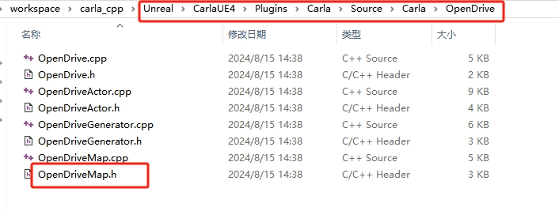
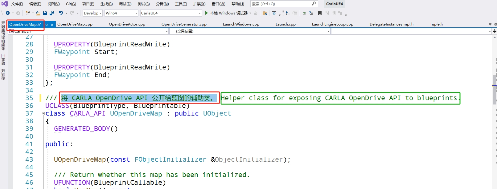
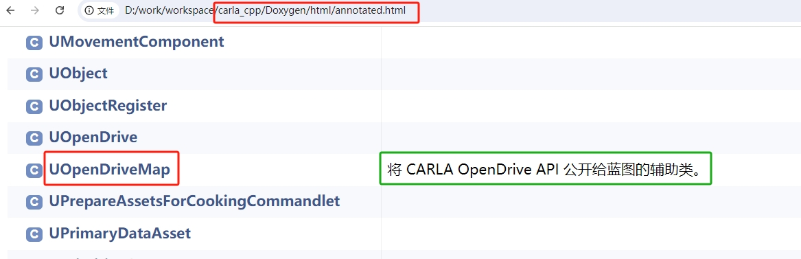

# Carla 的 C++ 文档
注释Carla的 [LibCarla](https://github.com/OpenHUTB/carla_cpp/tree/dev/LibCarla/source/carla) 、[CarlaUE4](https://github.com/OpenHUTB/carla_cpp/tree/dev/Unreal/CarlaUE4/Plugins/Carla/Source/Carla) 模块，包括实现方式、实现原理、流程图等。做出贡献之前请查看 [指南](https://github.com/OpenHUTB/PFC/blob/main/CONTRIBUTING.md) 。

## 生成文档
1.下载并安装[git](https://git-scm.com/downloads)  、[doxygen](https://www.doxygen.nl/download.html) ，可选软件：[GitTortoiseGit](https://tortoisegit.org/download/) 、VS2019社区版；

2.克隆仓库：
```shell
git clone https://github.com/OpenHUTB/carla_cpp.git
```

3.在项目主目录下运行以下命令，根据 C++ 代码生成对应的 html 文档：
```shell script
doxygen
```
进入`carla_cpp\Doxygen\html`目录下，双击或使用浏览器打开`dir_b14cdd661f9a7048a44f1771cd402401.html`、`dir_8fc34afb5f07a67966c78bf5319f94ae.html`或`index.html`查看修改后的效果。包括的文档：
- LibCarla/source/carla：[Doxygen/html/dir_b14cdd661f9a7048a44f1771cd402401.html](https://openhutb.github.io/carla_cpp/dir_b14cdd661f9a7048a44f1771cd402401.html) 

- CarlaUE4：[Doxygen/html/dir_8fc34afb5f07a67966c78bf5319f94ae.html](https://openhutb.github.io/carla_cpp/dir_8fc34afb5f07a67966c78bf5319f94ae.html) 

4.修改并本地测试没问题后，提交代码：
```shell script
git add .
git commit -m update
git push
```

## 修改方法
### 修改类的注释
1.比如对于`UOpenDriveMap`，修改之前：


2.找到需要修改的文件：


3.翻译代码中的注释或添加新注释：


4.运行`doxygen`重新生成文档，查看修改后的文档：


详细注释方法参见[注释规范](./annotation_specification.md) 。

## 新建开发分支
直接创建一个空白的分支，而是像普通的分支一样把原分支的内容拷贝过来：
```shell
git checkout --orphan dev
```
还需要手动删除孤立分支中的内容：
```shell
git rm -rf .
```

## 参考

- [Carla中文文档](https://openhutb.github.io/carla_doc/)
- [从源代码构建 Carla](https://openhutb.github.io/carla_doc/build_carla/)
- [在 Windows 上进行 Carla 的调试](https://openhutb.github.io/carla_doc/tuto_D_windows_debug/#cpp_client_debug)
- [dev分支提交历史](https://github.com/carla-simulator/carla/commits/dev/)
- [注释图片在文档里面查看](https://blog.csdn.net/qq_33154343/article/details/102809510)


## 贡献者列表
[nongfugengxia](https://github.com/nongfugengxia) 、[donghaiwang](https://github.com/donghaiwang) 、
[QEYY060506](https://github.com/QEYY060506) 、[Xiedao](https://github.com/Xiedao) 、[zzz479](https://github.com/zzz479) 、[ifthen865](https://github.com/ifthen865) 、[zuo664](https://github.com/zuo664)[qqggxx](https://github.com/qqggxx)。


