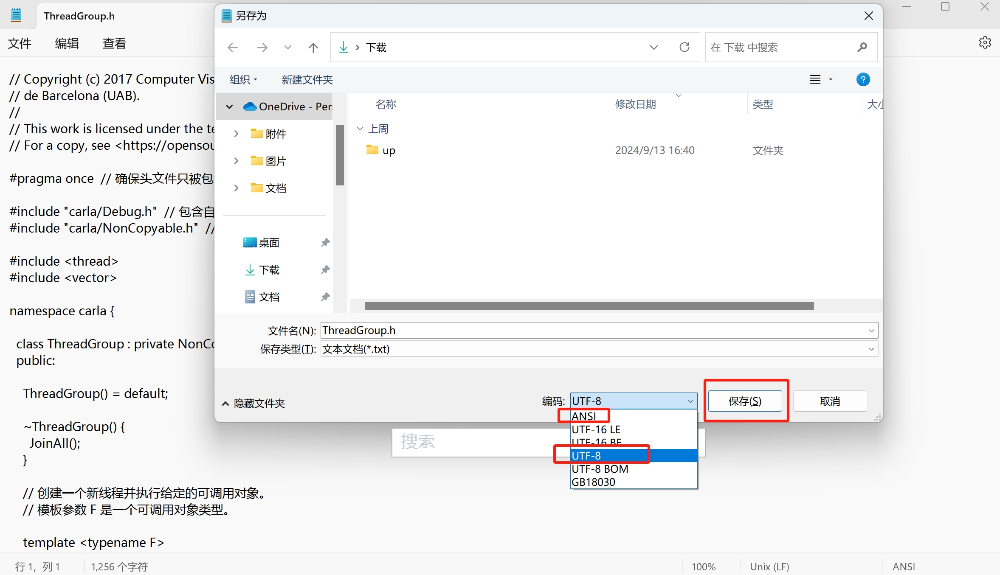

# Doxygen代码的注释规范

## 注释语法

### 注释格式
块注释建议统一使用
```shell
/**

……

*/
```

行注释建议统一使用
```cpp
///< …

/** …… */
```


###  Doxygen常用注释命令
@exception <exception-object> {exception description} 对一个异常对象进行注释。

@warning {warning message } 一些需要注意的事情

@todo { things to be done } 对将要做的事情进行注释，链接到所有TODO 汇总的TODO 列表

@bug 缺陷，链接到所有缺陷汇总的缺陷列表

@see {comment with reference to other items } 一段包含其他部分引用的注释，中间包含对其他代码项的名称，自动产生对其的引用链接。

@relates <name> 通常用做把非成员函数的注释文档包含在类的说明文档中。

@since {text} 通常用来说明从什么版本、时间写此部分代码。

@deprecated

@pre { description of the precondition } 用来说明代码项的前提条件。

@post { description of the postcondition } 用来说明代码项之后的使用条件。

@code 在注释中开始说明一段代码，直到@endcode命令。

@endcode 注释中代码段的结束。

@code .. @endcode 包含一段代码

@addtogroup 添加到一个组。

@brief  概要信息

@deprecated 已废弃函数

@details  详细描述

@note  开始一个段落，用来描述一些注意事项

@par  开始一个段落，段落名称描述由你自己指定

@param  标记一个参数的意义

@fn  函数说明

@ingroup 加入到一个组

@return  描述返回意义

@retval  描述返回值意义

@include 包含文件

@var、@enum、@struct、@class 对变量、美剧、结构体、类等进行标注


### 注释示例
#### 项目注释
项目注释块用于对项目进行描述，每个项目只出现一次，一般可以放在main.c主函数文件头部。对于其它类型的项目，置于定义项目入口函数的文件中。对于无入口函数的项目，比如静态库项目，置于较关键且不会被外部项目引用的文件中。

项目注释块以`"/** @mainpage"`开头，以`"*/"`结束。包含项目描述、及功能描述、用法描述、注意事项4个描述章节。

**项目**描述章节描述项目名称、作者、代码库目录、项目详细描述4项内容，建议采用HTML的表格语法进行对齐描述。

**功能**描述章节列举该项目的主要功能。

**用法**描述章节列举该项目的主要使用方法，主要针对动态库、静态库等会被其它项目使用的项目。对于其它类型的项目，该章节可省略。

**注意事项**章节描述该项目的注意事项、依赖项目等相关信息。

要善于使用表格及一些标号语句
```dtd
/**@mainpage  智能井盖固件程序
* <table>
* <tr><th>Project  <td>ble_app_smc 
* <tr><th>Author   <td>wanghuan 
* <tr><th>Source   <td>E:\keil_workspace\NORDIC\nRF52832_htwh_sdk15.0\examples\ble_peripheral\ble_app_smc_freertos-doxygen
* </table>
* @section   项目详细描述
* 通过智能井盖管理系统的部署，管理人员通过手机APP与管理平台就能对辖区内井盖的安装、开闭、状态进行管理，出现异常情况及时通知维护人员进行检修，保障排水正常，保障市民安全。
*
* @section   功能描述  
* -# 本工程基于蓝牙新品nRF52832开发
* -# 本工程基于蓝牙协议栈开发，协议栈版本 SDK-15.0
* -# 智能井盖采用NB-IoT模组为ME3616
* 
* @section   用法描述 
* -# 智能井盖检测器安装指导
* -# 智能井盖检测器使用前需配置使能
* 
* @section   固件更新 
* <table>
* <tr><th>Date        <th>H_Version  <th>S_Version  <th>Author    <th>Description  </tr>
* <tr><td>2018/08/17  <td>1.0    <td>S02010041808171   <td>wanghuan  <td>创建初始版本 </tr>
* <tr><td>2019/06/24  <td>1.3    <td>S02010041906241   <td>wanghuan  <td>
* -# 电信平台增加上报需应答，应答超时时间默认40s；\n
*       代码宏：ME3616_NOTIFY_NEED_RPLY_EN
* -# 新增PSM进入超时处理，默认超时处理模组关机，超时时间默认200s；\n
*       代码宏：ME3616_PSM_TIMEOUT_HANDLE_EN
* -# 信号强度获取接口函数修改，增加可靠性，详见 me3616_getSignal()；
* -# 调试指令新增周期上报测试指令，710A-0D
* </tr>
* </table>
**********************************************************************************
*/
```


#### 文件注释
文件注释块对源代码文件进行注释，包括头文件（*.h）、C++文件（*.cpp）或C文件（*.c）。文件注释块置于对应文件的开头，至少包括文件名（@file）、文件简要说明（@brief）、作者（@author）、创建日期（@date）和版本号（@version）5个标记。如下所示：
```dtd
/**@file  main.c
* @brief       项目主函数文件
* @details  主要包含协议应用栈程序框架，main函数入口
* @author      wanghuan  any question please send mail to 371463817@qq.com
* @date        2018-8-17
* @version     V1.0
* @copyright    Copyright (c) 2018-2020  江苏亨通光网科技有限公司
**********************************************************************************
* @attention
* 硬件平台:nRF52832_QFAA \n
* SDK版本：nRF5_SDK_15.0.0
* @par 修改日志:
* <table>
* <tr><th>Date        <th>Version  <th>Author    <th>Description
* <tr><td>2018/08/17  <td>1.0      <td>wanghuan  <td>创建初始版本
* </table>
*
**********************************************************************************
*/
```


#### 函数注释
该注释块对函数进行描述，位于对应函数的定义上方。

函数注释块包含以下内容：

- 简要说明标记（`@brief`），内容为方法或函数的简要说明。
- 详细描述，详细描述与@brief标记之间空一行”\n”或者使用@details。
- 若干个参数描述标记（@param），数量与该方法的输入参数个数相同。格式为：“@param 参数名称 参数说明”。
- 返回值标记（@return），描述该方法的返回值，格式为：“@return 返回值类型 返回值描述”。若返回值为void类型，则省略该标记。
- 返回值说明（@retval），对具体返回值进行描述说明。
特殊标记

-：生成一个黑心圆.

-#：指定按顺序标记。

::：指定连接函数功能。（注：空格和“:”有连接功能,但建议还是使用”::”。只对函数有用。）


以下是一个函数注释块实例，实际根据情况增减：
```dtd
/**@brief NB模组向云平台上报数据
* @param[in]  handle              NB模组驱动句柄
* @param[in]  *data                上报数据指针
* @param[in]  len                上报数据长度
* @param[in]  rcc_enabled          上报时是否主动释放RCC链接
* @param[in]  update_enabled    上报时是否更新注册(只适用于onenet)
* @param[in]  report_fail_try_type    上报失败重新注册类型 \n
* @ref NB_REPFAIL_REG_TRY 出错立即重试    \n
* @ref NB_REPFAIL_REG_DELAY_TRY 出错延缓重试，在延迟期间如果正常则重新延缓，适用于高频率上报（上报失败重新注册超时15min） \n
* @ref NB_REPFAIL_REG_NO_TRY 出错不重试
* @return  函数执行结果
* - NB_NOTIFY_SUCCESS      上报成功
* - NB_NOTIFY_FAIL        上报失败
* - NB_IOT_REGIST_FAILED 注册失败返回
* - Others  其他错误
* @par 示例:
* @code
*    移动平台发送数据 AT+MIPLNOTIFY=0,122553,3308,0,5900,4,4,50,0,0
*    电信平台发送数据 AT+M2MCLISEND=000101
* @endcode
* @see :: ME3616_FxnTable
*/
```

#### 枚举、结构体等注释
```dtd
/**@enum NB_msg_types_t
* @brief 定义驱动上报应用消息类型
*/
/**@struct ME3616_info_t
* @brief ME3616信息结构体 \n
* 定义存储ME3616的信息
*/
    typedef struct 结构体名字
    {
       成员1, ///< 简要说明文字 */ 如果不加<，则会认为是成员2的注释
       成员2, ///< 简要说明文字 
       成员3, ///< 简要说明文字 
    }结构体别名；
```

#### 模块注释
模块注释用于将一系列相关功能的函数、枚举、结构等归入一个模块并进行描述。模块注释块包括模块起始注释块及模块结束注释块两个部分。

模块起始注释块包含模块名称标记（`@defgroup`）、模块简介标记（`@brief`）、模块详细描述及模块起始标记（`@{`）4个部份。

模块结束注释用于结束一模块描述定义，格式为`"/** @} */"`。与模块起始注释块成对出现。包含在模块起始注释块与结束注释块之间的所有内容将归入该模块。

若需要将其它文件中定义的内容归入一个已定义的模块，可使用简略的模块起始注释块与结束注释块括起需要归入该模块的内容。简略的模块起始注释块仅包含相同的模块名称标记（`@defgroup`）。
```dtd
/**@defgroup bsp_me3616 Bsp me3616 driver module.
* @{
* @ingroup bsp_drivers
* @brief 使用该驱动之前，先进行驱动句柄的实例注册. \n
* ME3616驱动支持云平台Onenet和OceanConnect \n
* 当使能GPS驱动使能时，支持GPS操作 
*/


/** @} bsp_me3616*/
```

#### 分组注释
自定义命名的一组内容注释
```dtd
/**@name 协议栈用全局参数
* @brief 蓝牙5协议栈参数配置（广播、连接、安全等）相关宏定义，协议栈各模块句柄等全局参数
* @{
*/


/** @} 协议栈用全局参数 */
```


## 其他

### 文件编码
代码文件需要使用UTF-8编码保存，比如用记事本进行打开并使用UTF-8保存：


### VS2019开启快速生成文档注释
可以点击 `工具 -> 选项 -> 文本编辑器 -> C/C++ -> 代码样式`， 在`生成的文档注释样式`下拉列表中选择想要的注释形式。

选择`Doxygen(/**)` 时，只需要在方法名上输入`/**` 即可出现文档注释。


### 使用 VScode 进行注释
- 关闭vscode #ifdefine 宏开关会使代码自动暗色

解决：按 `Ctrl+Shift+p` ，输入 settings，打开设置界面：
搜索 `C_Cpp.dimInactiveRegions` ，取消勾选即可。

## 参考
- [Doxygen的注释规范](https://www.cnblogs.com/silencehuan/p/11169084.html)